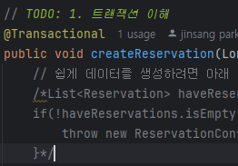
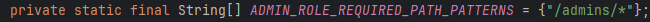
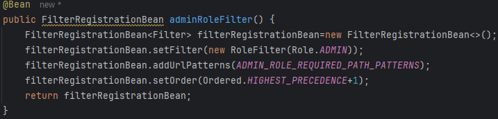
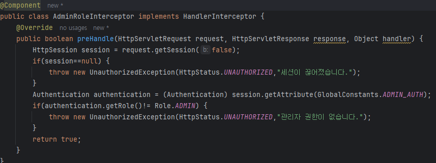
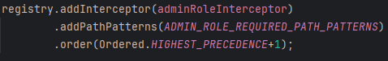
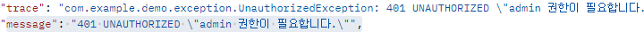

플러스 주차 개인과제 기반 코드입니다.
## 필수과제 풀이
### Q1.TODO 1. 
### A.


@Transaction의 어노테이션을 붙이면 해당 메소드내 데이터베이스 접근이 하나의 작업단위로 묶인다.
하나의 트랜잭션의 작업은 완전히 커밋되거나 완전히 롤백되어야한다. = 원자성

### Q2. TODO 2.
### A.

ADMIN 권한이 필요한 API를 만든다.
- [ ] 필터를 사용할 경우

- [ ] 인터셉터를 사용할 경우 (필터 주석)

ADMIN 인터셉터를 만든후 

사용하고자 하는 인터셉트와 위에서 설정한 API와 순서를 지정한다.
 이런 결과가 나옴 
### Q3. TODO 3.
페치조인을사용
<details>
<summary>수정 전 쿼리</summary>
<div markdown="1">       

```SQL
Hibernate: 
    select
        r1_0.id,
        r1_0.end_at,
        r1_0.item_id,
        r1_0.start_at,
        r1_0.status,
        r1_0.user_id 
    from
        reservation r1_0
Hibernate: 
    select
        i1_0.id,
        i1_0.description,
        m1_0.id,
        m1_0.email,
        m1_0.nickname,
        m1_0.password,
        m1_0.role,
        m1_0.status,
        i1_0.name,
        o1_0.id,
        o1_0.email,
        o1_0.nickname,
        o1_0.password,
        o1_0.role,
        o1_0.status,
        i1_0.status 
    from
        item i1_0 
    left join
        user m1_0 
            on m1_0.id=i1_0.manager_id 
    left join
        user o1_0 
            on o1_0.id=i1_0.owner_id 
    where
        i1_0.id=?
```

</div>
</details>

### A.

<details>
<summary>수정 후 쿼리</summary>
<div markdown="1">       

```SQL
Hibernate: 
    select
        r1_0.id,
        r1_0.end_at,
        i1_0.id,
        i1_0.description,
        i1_0.manager_id,
        i1_0.name,
        i1_0.owner_id,
        i1_0.status,
        r1_0.start_at,
        r1_0.status,
        u1_0.id,
        u1_0.email,
        u1_0.nickname,
        u1_0.password,
        u1_0.role,
        u1_0.status 
    from
        reservation r1_0 
    join
        user u1_0 
            on u1_0.id=r1_0.user_id 
    join
        item i1_0 
            on i1_0.id=r1_0.item_id
```

</div>
</details>

### Q4. TODO 4.
### A.
```java
@Transactional
    public void reportUsers(List<Long> userIds) {
        List<User> users = userRepository.findAllById(userIds);

       if(userIds.size()!=users.size()) {
           throw new IllegalArgumentException("해당 ID에 맞는 값이 존재하지 않습니다.");
       }
       for(User user:users){
           user.updateStatusToBlocked();
       }
    }
```

### Q5. TODO 5.
### A.
QueryDSL 관련 셋팅 후 페치조인으로 N+1문제 해결
```java
@Override
    public List<Reservation> getReservationByUserIdOrItemId(Long userId, Long itemId) {
        QReservation reservation = QReservation.reservation;

        return jpaQueryFactory.select(reservation)
                .from(reservation)
                .innerJoin(reservation.user).fetchJoin()
                .innerJoin(reservation.item).fetchJoin()
                .where(reservation.user.id.eq(userId).and(reservation.item.id.eq(itemId)))
                .fetch();
    }
```

### Q6. TODO 6.
### A.

### Q7. TODO 7.
### A.
- [X] 개선1. 필요하지 않은 else구문을 걷어 냅니다.
```java
 switch (status) {
            case "APPROVED": {
                if (!"PENDING".equals(reservation.getStatus())) {
                    throw new IllegalArgumentException("PENDING 상태만 APPROVED로 변경 가능합니다.");
                }
                break;
            }
            case "CANCELED": {
                if ("EXPIRED".equals(reservation.getStatus())) {
                    throw new IllegalArgumentException("EXPIRED 상태인 예약은 취소할 수 없습니다.");
                }
                break;
            }
            case "EXPIRED": {
                if (!"PENDING".equals(reservation.getStatus())) {
                    throw new IllegalArgumentException("PENDING 상태만 EXPIRED로 변경 가능합니다.");
                }

                break;
            }
            default: {
                throw new IllegalArgumentException("올바르지 않은 상태: " + status);
            }
        }
        reservation.updateStatus(status);

```
중간 피드백 후 이 코드 역할(status에따라 상태가 바뀌는)을 Status클래스가 해주면 어떨까 라는 피드백을 받고 
```java
public enum ReservationStatus {
    PENDING("PENDING") {
        @Override
        public boolean canChangeTo(ReservationStatus status) {
            switch (status) {
                case APPROVED, CANCELED, EXPIRED -> {
                    return true;
                }
            }
            return false;
        }
    }, APPROVED("APPROVED") {
        @Override
        public boolean canChangeTo(ReservationStatus status) {
            return status.equals(APPROVED);
        }
    }, CANCELED("CANCELED") {
        @Override
        public boolean canChangeTo(ReservationStatus status) {
            return status.equals(CANCELED);
        }
    }, EXPIRED("EXPIRED") {
        @Override
        public boolean canChangeTo(ReservationStatus status) {
            return status.equals(EXPIRED);
        }
    };

```
필요한 메서드를 만들어 사용하였다.
- [X] 개선2.컨트롤러 응답 데이터 타입을 적절하게 변경합니다.
- [X] 개선3.재사용 비중이 높은 findById 함수들을 default 메소드로 선언합니다.
- user쪽에서 중복으로 사용되던  findById함수를 
```java
default User findByIdOrElseThrow(Long id){
return findById(id).orElseThrow(() -> new IllegalArgumentException("해당 ID에 맞는 값이 존재하지 않습니다."));
}
```
- [X] 개선4.상태 값을 명확하게 enum으로 관리 합니다.
- [X] 개선5.첫번째 Transaction문제를 해결 했다면 RentalLogService save함수 내19~21번째 코드를 삭제하거나 주석처리하여 기능이 동작하도록 수정합니다..